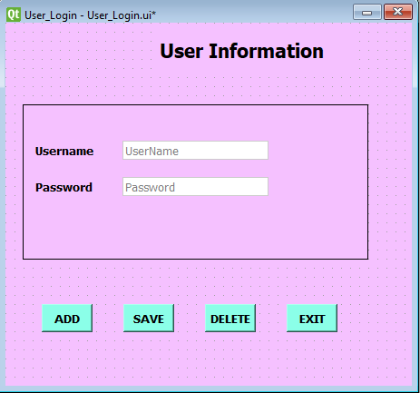
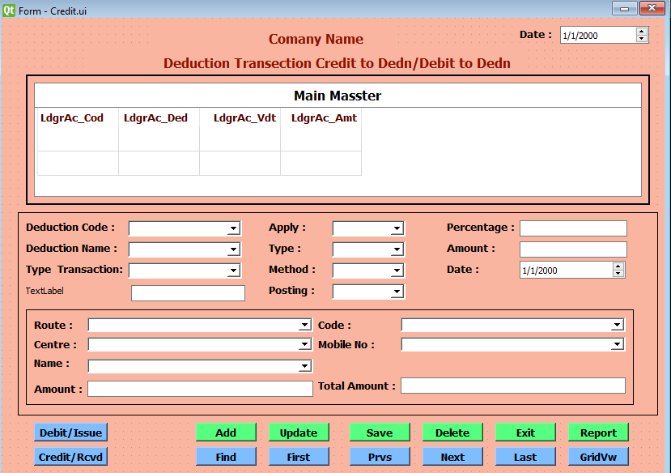
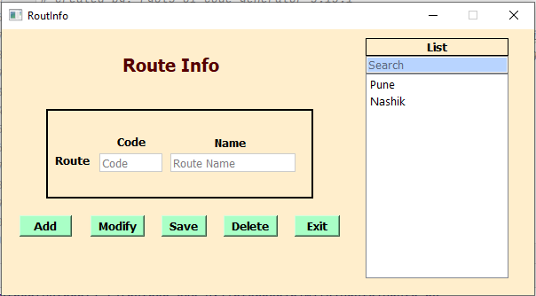
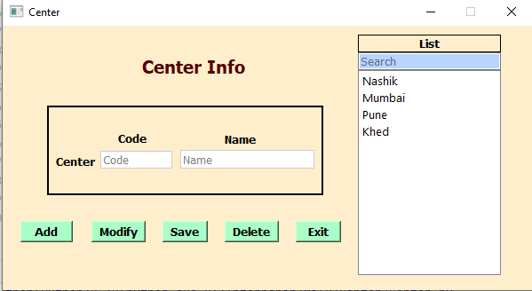
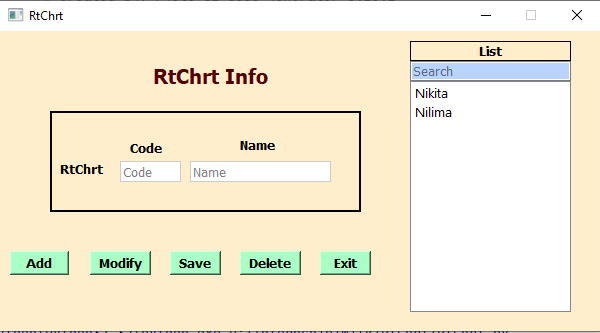
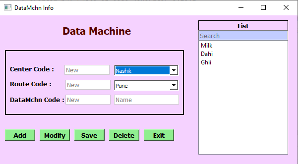
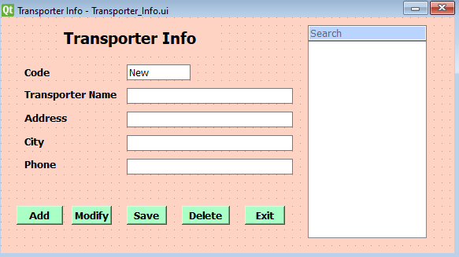
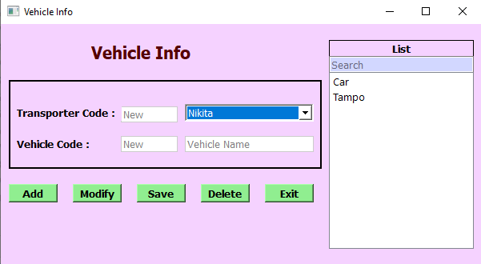
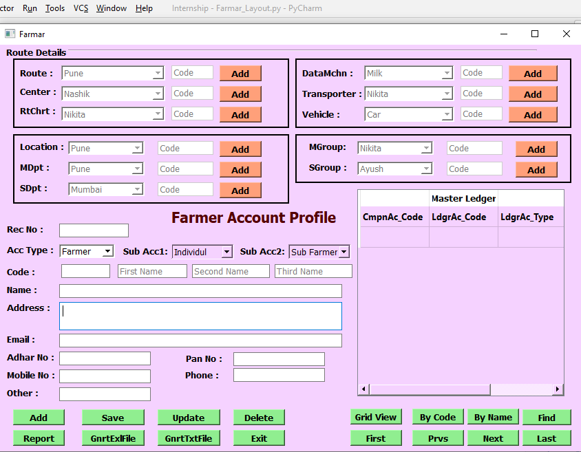

**Internship**

**Design form using PyQt5 in Python and Add Database connectivity Using SQLite**
    
This work was done during the virtual internship in the Months of Sept-Nov 2020 with Electroveda Infotech Pune.
This work based on UI designing and upload data into the databse SQLite.
This forms is design for the milk colletion system.

1 User Login

After successful installation of Qt Designer the User Login is the first form i was design. For installation i had taken the reference from this link

  

2 Credit Form

After designing this form i learn different properties of Qt Designer

  

3 Route Form

This form inclued the detail of Milk collection Route 

  

4 Center Form

This form inclued the detail of Milk collection Center

5 Route Chart Form

This Form inclued Route Chart information

6 Data Machine Form

  

7 Transporter Form

This form take the input from users and Display Transporter Information from database.

  

8 Vehical Form

This form take input of vehicle from user and display all vehicle Details from Database.

  

9 Farmars Milk Info 

This Form cantain all information of Milk Collection System.

  

